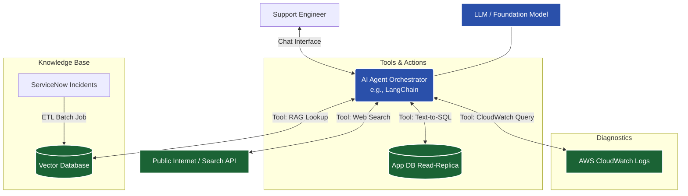

# Production Support AI Agent - Solution Architecture

This document outlines the proposed solution architecture for building an AI-powered production support agent that integrates with your application database, AWS CloudWatch, ServiceNow, and public web search.

## High-Level Architecture

The core of this solution uses an **Agentic Framework** (such as LangChain or LangGraph) that leverages a Large Language Model (LLM) to route user queries to specialized tools based on intent.

## Core Components

### 1. Agent Orchestrator
*   **Technology**: Python with **LangChain** or **LangGraph**.
*   **Role**: Acts as the brain. It analyzes the user's prompt, decides which tool to use, extracts parameters (like timeframes or error codes), executes the tool, and synthesizes the final response.
*   **LLM Choice**: Amazon Bedrock (e.g., Claude 3.5 Sonnet) since you are already in AWS, or Azure OpenAI / OpenAI GPT-4.

### 2. Database Querying (Text-to-SQL)
*   **Mechanism**: The agent uses a Text-to-SQL tool. The LLM is provided with the database schema (tables, columns, relations).
*   **Safety**: **CRITICAL:** The agent MUST connect only to a **Read-Replica** of the application database with a read-only user to prevent accidental data modification or dropping of tables (SQL Injection risks).
*   **Formatting**: The agent executes the generated SQL query, retrieves the raw rows, and formats them into a Markdown table or generates a downloadable CSV report.

### 3. AWS CloudWatch Integration
*   **Mechanism**: Use AWS SDK (`boto3`) to create a custom LangChain tool.
*   **Workflow**: When asked to investigate an issue, the agent uses the tool to run **CloudWatch Logs Insights** queries. It dynamically generates the CloudWatch Insights query syntax to search for `ERROR`, `Exception`, or specific trace IDs within a given timeframe.

### 4. ServiceNow Knowledge Base (RAG System)
*   **Mechanism**: Retrieval-Augmented Generation (RAG).
*   **Ingestion Pipeline (ETL)**: A scheduled job connects to the ServiceNow REST API to pull 'Closed'/'Resolved' incidents. It extracts the Description, Resolution Notes, and Root Cause.
*   **Vector Database**: The extracted incident text is converted into embeddings (using models like OpenAI text-embedding-3 or AWS Titan) and stored in a Vector DB (e.g., Pinecone, AWS OpenSearch Serverless, Qdrant).
*   **Querying**: When an error is found from CloudWatch, the agent queries the Vector DB to find semantically similar historical incidents to retrieve past solutions.

### 5. Web Search Fallback
*   **Mechanism**: Use a search tool like **Tavily**, **DuckDuckGo**, or **Bing Search API**.
*   **Logic**: If the similarity score of the ServiceNow RAG retrieval is too low (meaning this is a novel issue), the agent catches this condition and automatically queries the public web for documentation, StackOverflow discussions, or vendor forums related to the specific exception trace.

## Example Workflow: "Why is the checkout page failing today?"

1.  **User**: "Why is the checkout page failing today?"
2.  **Agent -> CloudWatch Tool**: Runs an Insights query on the `checkout-service` log group for the last 12 hours looking for `level=ERROR`.
3.  **CloudWatch Tool -> Agent**: Returns logs showing a `DatabaseTimeoutException: Connection pool exhausted`.
4.  **Agent -> ServiceNow Vector DB (RAG) Tool**: Searches for "DatabaseTimeoutException Connection pool exhausted".
5.  **Vector DB -> Agent**: Returns historical Incident INC0012345, which was resolved by "Scaling up PostgreSQL concurrent connections from 100 to 200".
6.  **Agent -> User**: "The checkout page is failing due to a `DatabaseTimeoutException`. based on historical ServiceNow incident INC0012345, this usually occurs when the connection pool is exhausted. The previous solution was to scale up the concurrent connections from 100 to 200. Shall I check the current DB metrics using the DB tool?"

## Example Workflow: Fallback Scenario

If step 5 yields no historical incidents, the Agent invokes the **Web Search Tool** for "DatabaseTimeoutException AWS RDS PostgreSQL" and reports back community-recommended troubleshooting steps.

## Security & Compliance Considerations

> [!WARNING]
> **Data Privacy & PII**
> - Ensure that the logs pulled from CloudWatch do not leak PII to public LLM endpoints. If using AWS, consider **Amazon Bedrock** which keeps data within your VPC and doesn't use it for training.
> - Scrub ServiceNow incidents for user PII before embedding them into the Vector Database.

> [!CAUTION]
> **Database Access**
> - The Agent **must never** have write access to the database. Use strict IAM and DB-level roles to limit the execution to `SELECT` queries on approved tables only.

## Implementation Decisions & Dual-Agent Architecture

Based on our discussions, the architecture will support **both** an MS Teams bot and a GitHub Copilot Extension simultaneously. To achieve this, we will refactor the existing CLI bot into a centralized REST API backend.

### Technical Stack Updates
1. **Core API Engine**: **FastAPI**, which will expose routing endpoints.
2. **LLM Core**: Public OpenAI API (`gpt-4o`) via LangChain.
3. **Database Engine**: MySQL for the local baseline prototype.
4. **Endpoint 1 (MS Teams)**: A `/api/messages` endpoint constructed to receive payloads from the Microsoft Bot Framework.
5. **Endpoint 2 (Copilot Extension)**: A `/api/copilot` endpoint constructed to act as a GitHub Copilot Chat Participant, accepting SSE (Server-Sent Events) payload standards.

### Why this approach?
By abstracting the LangChain Agent `AgentExecutor` logic into a decoupled module, both the Teams interface and the Copilot Extension can forward their user messages to the exact same "Brain" and receive the same tool-calling capabilities. 

---
**Next Step [User Review Required]**: Please review this architectural pivot to a FastAPI-driven microservice. If you approve, I will proceed to execution—refactoring `bot.py` into `app.py` and adding the routing logic for both platforms!
